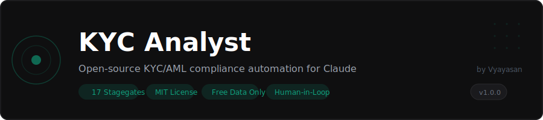

<p align="center">
  
</p>

<p align="center">
  <a href="https://github.com/vyayasan/kyc-analyst/blob/main/LICENSE"></a>
  <a href="https://github.com/vyayasan/kyc-analyst/releases"></a>
  <a href="https://claude.ai/cowork"></a>
  <a href="https://www.linkedin.com/in/sandipanee"></a>
  <a href="https://twitter.com/vyayasan"></a>
</p>

---

Open-source KYC/AML compliance automation that replaces platforms costing teams tens of thousands per year. Uses only free public data sources. 17 mandatory human-in-the-loop checkpoints -- AI assists, the analyst decides.

Built for [Claude Cowork](https://claude.ai/cowork), also compatible with [Claude Code](https://claude.ai/code).

**[Demo Slides (PDF)](./docs/demo-slides.pdf)** -- 22-page walkthrough of the full onboarding workflow and output samples.

---

## Why This Exists

Compliance analysts spend most of their time navigating public websites, screening free databases, and writing reports. The underlying data sources (OFAC, UN, EU sanctions lists, Companies House, OpenSanctions) are all free. The risk formulas (MLR 2017, FinCEN CDD) are published.

This plugin orchestrates all of that while enforcing 17 mandatory human-in-the-loop checkpoints. No auto-approvals. No skipping. The analyst stays in control.

## Pilot Results

One UK fintech ran this plugin for 30 days with 12 compliance analysts:

| Metric | Before | After |
|--------|--------|-------|
| Time per case | 95 min | 27 min |
| Annual cost | Platform vendor | Claude Pro subscription |
| Legal review | -- | Approved for production |
| Outcome | -- | Vendor cancelled |

## How It Works

```
Customer docs --> Claude extracts --> Analyst verifies
                                          |
                                    [STAGEGATE 1-5]
                                          |
Step 0: 6 mandatory searches --------> Analyst reviews each
  - Adverse media (72+ sources)           |
  - ICIJ Offshore Leaks              [STAGEGATE 6-12]
  - Directorships (Companies House)       |
  - PEP status (5 databases)             |
  - Professional background               |
  - Sanctions (OFAC/UN/EU/UK)             |
                                          v
Risk scoring (deterministic) --------> Analyst approves
  - Geographic 30%                        |
  - Customer 35%                    [STAGEGATE 13-14]
  - Product 25%                           |
  - Channel 10%                           v
                                    PROCEED or ESCALATE
                                          |
                                    [STAGEGATE 15-17]
                                          |
                                    Excel + PDF + Case Folder
```

Every arrow with `[STAGEGATE]` requires explicit analyst consent. 17 total.

## Commands

| Command | What it does |
|---------|-------------|
| **[/kyc:onboard](./commands/onboard.md)** | Full customer onboarding with Step 0 independent verification, sanctions screening, PEP checks, risk scoring, and report generation |
| **[/kyc:onboard-interactive](./commands/onboard-interactive.md)** | Same workflow with step-by-step dialog guidance |
| **[/kyc:screen](./commands/screen.md)** | Standalone sanctions and PEP screening |
| **[/kyc:risk](./commands/risk.md)** | Risk reassessment with updated due diligence |
| **[/kyc:monitor](./commands/monitor.md)** | Transaction monitoring and AML reporting |
| **[/kyc:refresh](./commands/refresh.md)** | Periodic customer review |

## Getting Started

### Cowork

Upload this plugin folder to Cowork, then run:

```
/kyc:onboard-interactive "Jane Smith" -- UK resident, salaried employee, standard risk
```

### Claude Code

```bash
# Clone the repo
git clone https://github.com/vyayasan/kyc-analyst.git

# Install Python dependencies (for Excel and PDF generation)
pip install -r requirements.txt
```

See [QUICK_START_GUIDE.md](./QUICK_START_GUIDE.md) for a full walkthrough of your first case.

## What You Get

- **Step 0 Independent Verification** -- 6 mandatory searches across 90+ sources before any due diligence begins
- **Deterministic Risk Scoring** -- Four-factor weighted model with published formulas. Same inputs always produce the same score.
- **Excel Dashboard** -- 4-sheet workbook (Executive Summary, Directorships, Discrepancies, Risk Assessment) via openpyxl
- **PDF Report** -- 17-section compliance report via fpdf2
- **Case Folder** -- Numbered folder structure (001-006) with immutable audit trail
- **Multi-jurisdiction** -- UK/EU (AMLD5, MLR 2017, FCA), US (FinCEN, BSA/AML, OFAC), MENA (CBUAE, SAMA)

## Data Sources

All free and public:

| Source | Coverage |
|--------|----------|
| OFAC SDN | US sanctions |
| UN Consolidated List | Global sanctions |
| EU Sanctions List | EU sanctions |
| UK HMT | UK sanctions |
| OpenSanctions PEP | 100+ countries |
| Companies House API | All UK entities |
| ICIJ Offshore Leaks | Panama Papers, Paradise Papers, Pandora Papers |
| SEC EDGAR | US public filings |

For premium sources (World-Check, LexisNexis, Dow Jones), add your own API keys via the connector system. See [CONNECTORS.md](./CONNECTORS.md).

## Workflow Templates

Five ready-to-use templates in [WORKFLOW_TEMPLATES.md](./WORKFLOW_TEMPLATES.md):

| Template | Use case | Time |
|----------|----------|------|
| Template 1 | Salaried employee, standard risk | 15-20 min |
| Template 2 | HNWI, enhanced due diligence | 45-60 min |
| Template 3 | SME corporate onboarding | 30-40 min |
| Template 4 | Complex corporate, multi-jurisdiction | 60-90 min |
| Template 5 | Existing customer refresh | 20-30 min |

## Plugin Architecture

- **Skills** -- Domain knowledge for onboarding, screening, risk assessment, transaction monitoring, and KYC refresh. Each skill defines mandatory stagegates that Claude follows automatically.
- **Commands** -- Six slash commands you invoke explicitly. Each one maps to a regulatory workflow.
- **Connectors** -- Tool-agnostic `~~placeholder` syntax that works with Google Drive, Box, Salesforce, Chrome, Slack, and others. Edit `.mcp.json` to point at your specific tool stack.
- **Stagegates** -- 17 mandatory checkpoints requiring explicit analyst consent. No auto-approvals, no skipping, no proceeding on silence.

```
kyc-analyst/
├── .claude-plugin/plugin.json   # Manifest
├── .mcp.json                    # Tool connections
├── commands/                    # Slash commands you invoke explicitly
├── skills/                      # Domain knowledge Claude draws on automatically
├── EXAMPLES/                    # Five worked examples with expected outputs
├── OUTPUT_TEMPLATES/            # Locked PDF and case folder formats
├── docs/                        # Demo slides and assets
├── WORKFLOW_TEMPLATES.md        # Copy-paste workflow templates
├── QUICK_START_GUIDE.md         # 10-minute first case walkthrough
├── CONNECTORS.md                # Tool integration guide
└── requirements.txt             # Python dependencies (fpdf2, openpyxl)
```

## Background

Built by someone with 15 years in compliance (Thredd, HSBC, RBC, Discover). Small teams (1-20 analysts) were paying significant amounts annually for platforms that navigate public websites, screen free data sources, calculate risk scores using open formulas, and generate reports. Foundation models can do all of this.

Not building a company. Testing a thesis: foundation models commoditized GRC middleware for SMB compliance teams.

## Contributing

Plugins are just markdown files. Fork the repo, make your changes, and submit a PR. See [CONTRIBUTING.md](./CONTRIBUTING.md) for details on testing, stagegate rules, and jurisdiction support.

Looking for contributors who work in compliance (any country) to add jurisdiction-specific workflows.

## License

[MIT](./LICENSE)
